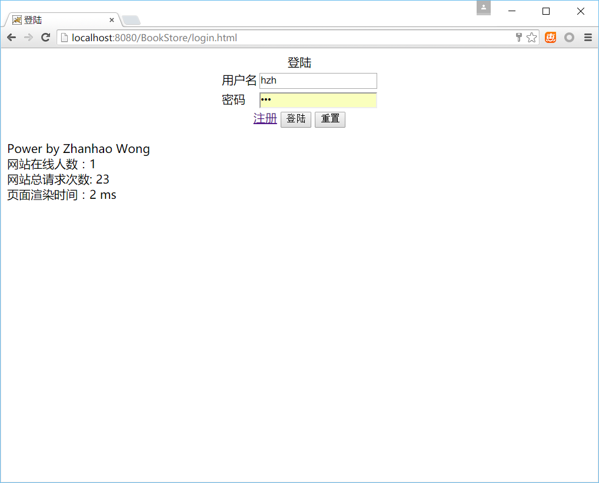
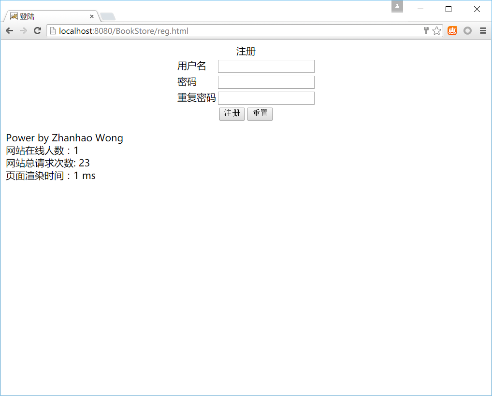
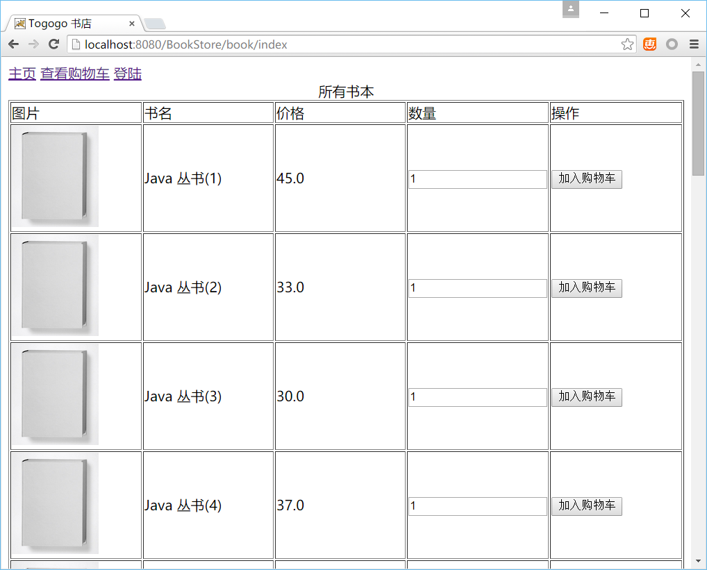
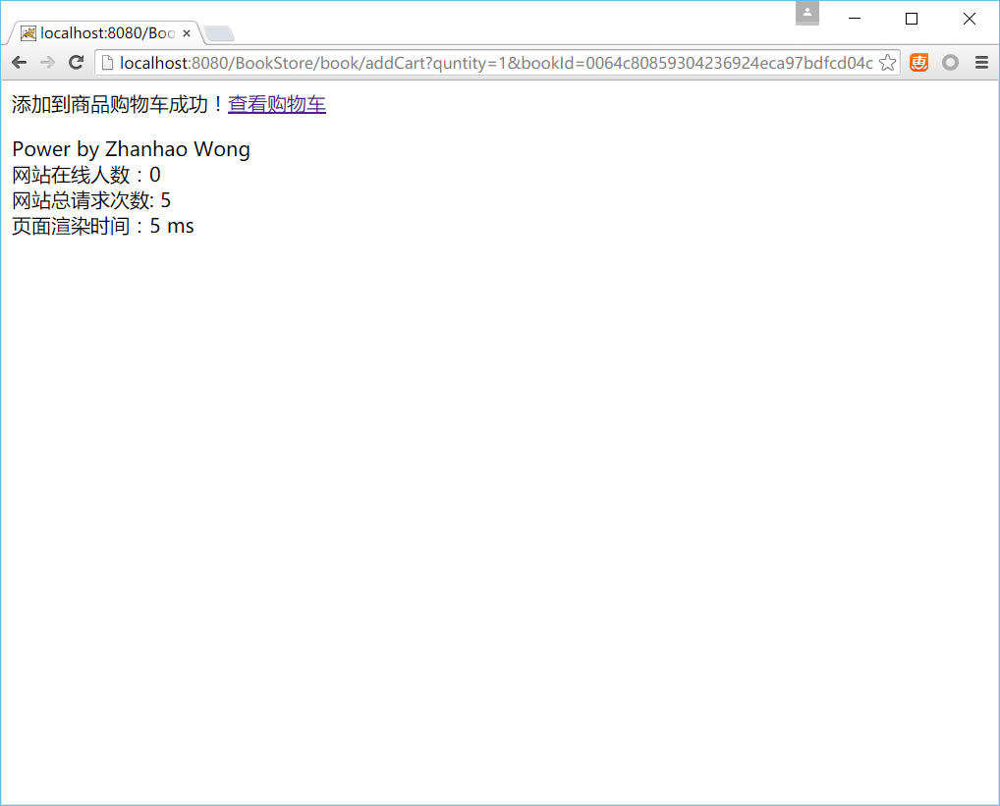
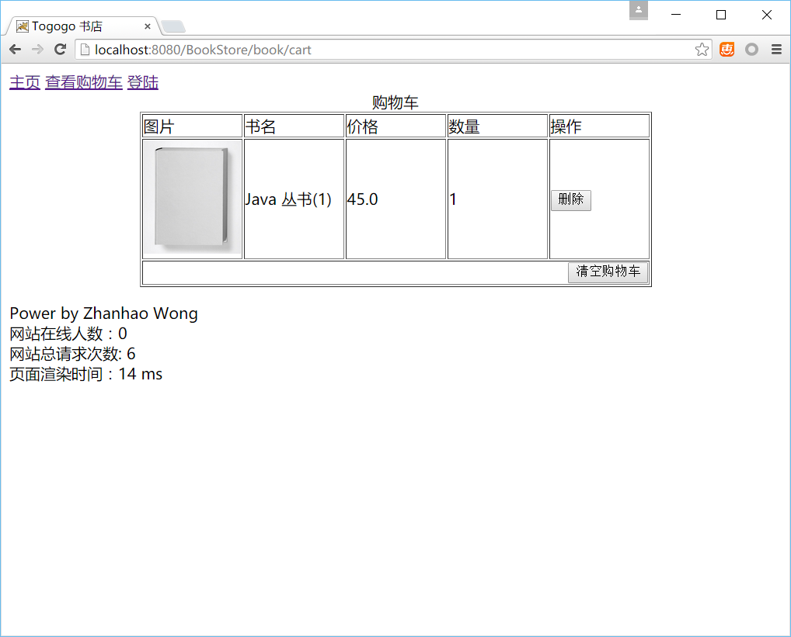
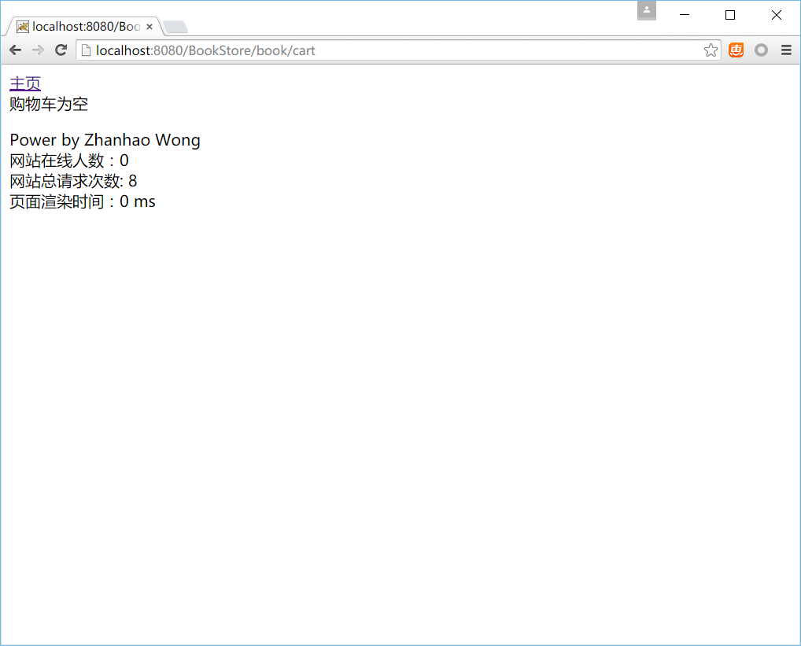
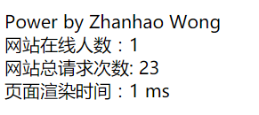

# 网上书城(Book Store) Servlet 练习
------
## 需求
  * 完成用户模块包括用户注册
  * 完成购物车模块添加购物车，删除购物车中的商品，清空购物车
  * 完成网站信息获取和统计


## 预备知识
  * `HTTP` 协议请求原理
  * `Tomcat` 的使用和应用的部署
  * `Servlet` 的用法
  * `Request` 、 `Response`、`Session`、`ServletContext`API 的用法
  * `Filter` 过滤器的用法和使用场景
  * `Linstener` 常用监听器的用法
  * `JDBC`操作数据库
  * `Java` 反射技术（可选）
  
## 模块实现
### 用户模块
需要到的技术，`JDCB`，`Servlet`，`Filter`， `Session`， `Request`， `Response`。建议只建立一个`UserServlet`然后通过多`url-mapping`的方式，增强模块化。在进行编码前，需要先根据需求在数据库中建立好`User`表
#### 1. 登陆
建立一个`login.html`作为登陆页，输入登录名密码后，提交到相应的`Servlet`处理，`Servlet`中通过`DAO(数据访问对象)`中的查询方法通过登录名查询数据库，获得数据后包装成`User`对象，从包装的`User`对象中获得密码与当前登陆密码对比，如果相同，把`User`对象存进`Session`中，最后重定向回主页，如果不同，直接打印`登陆失败`字符串到浏览器。
> 要点
> 1. 在`Servlet`处理方法要注意判断提交的字段时候为空
> 2. 从数据库中获得的密码如果是加密的，需要把提交的密码也进行加密后才能比对
> 3. 存进`Session` 中是用`setAttribute`方法，`name`参数建议定义为常量，方面存储。



#### 2. 注册
建立一个`reg.html`作为注册页面，输入登录名、密码、确认密码后，提交到相应的`Servlet`处理，获得数据后包装成`User`对象，通过`DAO(数据访问对象)`中的插入方法把数据插入到数据库的`User`表，最后重定向回`登陆页`，如果出现失败，则根据把失败信息打印到浏览器。
> 要点
> 1. 在`Servlet`处理方法要注意判断提交的字段时候为空，并且需要校验两次密码输入时候相同
> 2. `User`表中的主键可以数据库生成，如果数据库不生成，则需要我们手动设置（必须保证唯一）
> 3. （可选）保存在数据库中的密码应该是加密的

``` java
/**
 * 用户
 * @author Zhanhao Wong
 */
public class User {
	
	/** 用户id **/
	private String id;
	
	/** 用户名 **/
	private String username;
	
	/** 用户密码 **/
	private String password;
	
	// 省略 get set 方法....
}
```



#### 3. 用户中心
进去用户中心对应的`Servlet`处理方法前，先通过一个`UserFilter`的过滤器，过滤器中从`Session`中取出用户信息，如果成功，则说明已经登陆过了，直接进入相关`Servlet`处理方法，处理方法中返回用户信息到浏览器中，如果失败，直接重定向到登陆页。
> 要点
> 1. 在配置`filter`的`url-mapping`时只需要过滤我们需要判断要登录才能访问的路径即可
> 2. 用`Session`的`getAttribute`方法时需要注意`name`不要搞错（同登陆时保存的常量，在同一个类中获取）

#### 4. 注销登陆
进去对应的`Servlet`处理方法，把`Session`中用户信息清空，然后直接重定向到主页。
> 要点
> 1. 用`Session`的`setAttribute`方法清空（设置成null）时需要注意`name`不要搞错（同登陆时保存的常量，在同一个类中获取）

#### 5. 用户权限过滤器
创建一个`UserFilter`。通过判断`Session`中时候存在用户信息来判断用户时候登陆，如果登陆了，调用`chain.doFilter`方法继续往下调用`filter`或`servlet`，反之，则重定向到登陆页面。
> 要点
> 1. 在配置`filter`的`url-mapping`时只需要过滤我们需要判断要登录才能访问的路径即可
> 2. 用`Session`的`getAttribute`方法时需要注意`name`不要搞错（同登陆时保存的常量，在同一个类中获取）


### Book模块
需要到的技术，`JDCB`，`Servlet`，`Cookie`， `Session`， `Request`， `Response`。建议只建立一个`BookServlet`然后通过多`url-mapping`的方式，增强模块化。在进行编码前，需要先根据需求在数据库中建立好`Book`表，并初始化好一些数据。

#### 1. 主页
进入主页相应的`Servlet`处理方法，`Servlet`中通过`DAO(数据访问对象)`中的查询方法，从数据库的`Book`表中读取所有的列，并且把它封装成`List<Book>`对象返回，最后在`Servlet`处理方法中，把`List`组装成`HTML`页面内容返回。
``` java
/**
 * 书本
 * @author Zhanhao Wong
 */
public class Book {
	
	/** 书本id **/
	private String id;
	
	/** 书本名称 **/
	private String name;
	
	/** 书本价格 **/
	private double price;
	
	/** 书本图片地址 **/
	private String pic;
	
	// 省略 get set 方法....
}
```


#### 2. 加入购物车
在主页中，点击加入购物车按钮将提交一个用两个请求参数`bookId`和`quntity`，到对应`Servlet`的对应处理方法中，在封装前需要取出当前客户端传过来的`Cookie`时候已经存在购物车的`Cookie`了，如果有沿用原来的`Cookie`，然后根据两个参数，把新的信息跟原来的信息（如果有）封装成一个格式化后的字符串对象（格式看下面的要点），最后以`Cookie`的形式返回到客户端浏览器中。并且返回`添加商品到购物车成功`
> 要点
> 1. 需要判断数量参数（quntity）时候合法。
> 2. 格式化后的字符串对象格式为： `ID:数量,ID2:数量` ，例如`1:1,2:1,3:1,4:1,5:1`
> 3. 需要判断重复，也就是去重



### 3、查看购物车
进入查看购物车相应的`Servlet`处理方法，`Servlet`先从`cookie`中获得购物车信息，然后根据我们定义的字符串格式提取信息（bookId，数量）后通过`DAO(数据访问对象)`中的查询方法，从数据库的`Book`表中读取所有的`Book`，然后吧所有的`Book`把它封装成`Map<Book，Integer>`对象返回，最后在`Servlet`处理方法中，把`Map`组装成`HTML`页面内容返回。如果购物车`cookie`为空，则返回`后购物车为空`
> 要点
> 1. cookie中获得的格式化后的字符串对象格式为： `ID:数量,ID2:数量` ，例如`1:1,2:1,3:1,4:1,5:1`
> 2. `Map<Book，Integer>`对象中的`value`值是数量，类型为`Integer`，是从解析后的`cookie`信息中获取的




### 4. 删除或清空购物车的商品
在购物车页面中，点击删除或清空购物车，触发一个请求，带一个参数，`bookId`到删除购物车对应的`servlet`的处理方法中，通过想判断`bookId`时候等于`all`，如果是，说明是清空购物车，直接返回一个新的购物车`cookie`且值为空，返回给浏览器，如果不是，则为一个`bookId`。接下来从`request`中带过来的`cookie`中找到购物车对应的`cookie`，获得购物车格式化字符串，操作字符串，把对应的`bookId`的部分从字符串中删除，重新把这个字符串设置为`cookie`的新值，返回到浏览器，同时返回字符串`删除购物车成功过`到浏览器中。
> 要点
> 1. cookie中获得的格式化后的字符串对象格式为： `ID:数量,ID2:数量` ，例如`1:1,2:1,3:1,4:1,5:1`
> 2. 操作字符串时，可以先把字符串转换成Map，然后删除后，重新遍历生成新的字符串。

### 通用模块
需要到的技术，`JDCB`，`Filter` `Session`， `Request`， `Response`， `Java`反射。


#### 1. 通用监听器
* `ServletContext `监听器
在应用启动的时候打印信息。参考前面的学习。

* `Session `监听器
用于在线人数统计，监听`Session`对象创建和销毁，把所有滑动用一个List维护，并且把`List`保存在`ServletContext`中。参考前面的学习。

* `Request` 监听器
用于统计应用请求次数统计，监听`Request`对象的创建和销毁，在`ServletContext`中保存一个客户端请求数，每次Requst创建是给请求数加一，并且重新保存到`ServletContext`中。参考前面的学习。

#### 2. 通用过滤器
* 编码过滤器
创建一个`EncodingFilter`。请参考之前的学习中，编写一个编码过滤器

* 日志过滤器
创建一个`LogFilter`。请参考之前的学习中，编写一个日志过滤器，打印访问过的链接

* 网站信息页脚过滤器
给页面添加页脚显示网站信息，通过从`ServletContext`保存的信息中获取，在调用玩`chain.doFilter`之后通过`response.getWriter`把信息输出。信息如下：
>1. 作者信息：从`ServletContext`的`getInitParameter`从`web.xml`中获得
>2. 应用（网站）请求次数：从`ServletContext`中获得（里面的信息由上面的`Request` 监听器维护）
>3. 在线人数：从`ServletContext`中获得（里面的信息有上面的`Session `监听器维护）
>4. 页面渲染时间：在`filter`开始的时候记录一个时间，调用`chain.doFilter`之后再记录一次时间，两个时间相减得到页面渲染时间。

	


#### 3. 通用`DAO`操作类(可选)
编写一个通用的`DAO`，里面拥有`save`方法和`find`方法。根据反射获得要插入或查询的`bean`对象对应的类的属性，然后拼装`SQL`语句，通过`JDBC`来执行`SQL`语句。参考之前写过的通用XML保存的写法。

> 要点
> 1. 必须约定好，需要对象对应类的属性名与数据库对应表的字段一致，类名跟表名一致
> 2. 需要先把表建好